<h1 align="center">Hi 👋, I'm Adrian Villanueva!</h1>
<h3 align="center">Software Engineer | Cloud Infra | Data Engineer</h3>

  

  
  
  
  

## 💫 About Me

- 🔭 Currently working as a **Cloud & Data Engineer**
- 💻 Core stack: **Python, Rust, Go, Java** | DevOps: **Terraform, K8s, Docker, AWS, GCP, Azure**
- 📊 Data Engineering: **Spark, Airflow, Databricks, DBT, Kafka**
- 🌟 Interests: **Self-hosting, AI/ML, Cloud Infrastructure, Green Tech**
- 🌐 Worked across **Netherlands** 🇳🇱, **Spain** 🇪🇸, and **Japan** 🇯🇵
- ⚡ I write code while listening to metal 🤘
- 🏃‍♂️ Outside tech: **Hiking, Photography, Cooking, Gaming, Gardening & Lifting**

## Latest Blog Post

<!-- BLOG-POST-LIST:START -->
- [Applying data engineering for image editing](https://metalops.dev/blog/data-engineering-for-photo-editing/) — Building an automated CLI pipeline in Python to process RAW photos into responsive AVIF variants wit
- [Building a Fail2Ban log parser with rust](https://metalops.dev/blog/fail2ban-log-parser-intro/) — Part 1 of the Building a Multi-Language Parser series,  deep dive into how the fail2ban-log-parser-c
- [Welcome to Metalops](https://metalops.dev/blog/metalops/) — Brief introduction about metalops and its contents
<!-- BLOG-POST-LIST:END -->

▶ [More posts on metalops.dev](https://metalops.dev)

## 🛠️ Tech Stack

  <!-- Languages -->
  
  
  
  
  
  
  
  
  

  <!-- Frameworks & Libraries -->
  
  

  <!-- Data Engineering -->
  
  
  
  

  <!-- Databases -->
  
  
  
  

  <!-- Cloud & DevOps -->
  
  
  
  
  
  
  
  

  <!-- Operating Systems -->
  
  

  <!-- AI & ML -->
  
  

## 📊 GitHub Stats

  

  

## 🌐 Connect With Me

  
  
  
  

  <em>Open to collaborations, open source, consulting, and new opportunities — feel free to reach out!</em>

---

  

<em>This GitHub profile and its contents are personal and do not represent any employer.</em>

